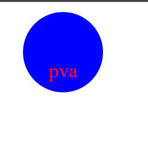

# Object-oriented-Programming

# Description
Creating a logo with your characters. You can choose from the list of shapes - Triangle, Circle, or Square
You can choose the color of the text and shape by using a color keyword or the hex code. 
After entering in your information, it will create a logo.svg.

# Usage
- question 1 will prompt for text
- question 2 will prompt color of the text
- Question 3 will prompt the shape
- question 4 will prompt the color of the shape

# screenshot and live
 

https://drive.google.com/file/d/1H9ZH3uPuw0CKH6aXCtQ9_JXvdSzcN4VZ/view
